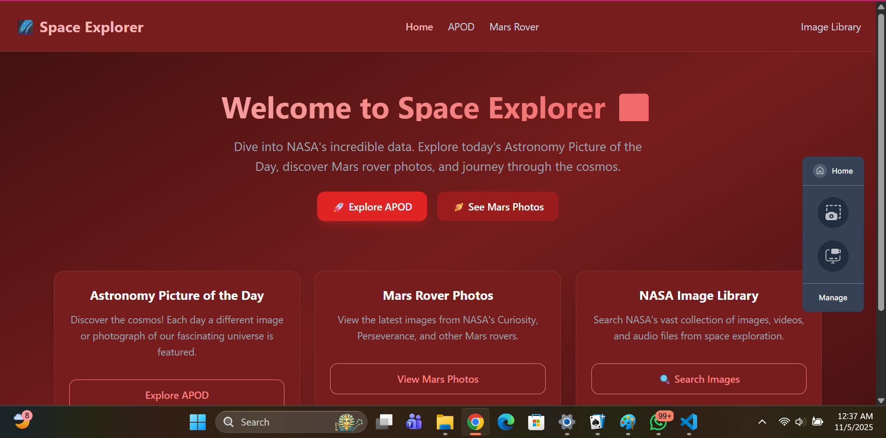

#  Space Explorer

A responsive React application exploring NASA's open APIs with beautiful UI built with React, TypeScript, and Tailwind CSS.

##  Features

- **Astronomy Picture of the Day (APOD)** - Daily space images with date picker and random date selection
- **Mars Rover Photos** - Explore images from NASA's Curiosity rover
- **NASA Image Library** - Search NASA's vast collection of space imagery
- **Responsive Design** - Works perfectly on all devices
- **Smooth Animations** - Enhanced user experience with Framer Motion
- **Error Handling** - Graceful fallbacks when APIs are unavailable

##  Technologies Used

- **React 18** with TypeScript
- **Vite** for fast development
- **Tailwind CSS** for styling
- **React Router** for navigation
- **Framer Motion** for animations
- **NASA APIs** for space data

## Screenshots

### Home Page


### APOD Page  


### Mars Rover Page


### Image Library


##  Live Demo

[Deployed Application Link](#) *(https://willowy-truffle-d46f35.netlify.app/)*

##  Installation & Setup

1. **Clone the repository**
   ```bash
   git clone https://github.com/Toti-o/space-explorer.git
   cd space-explorer
   ```

2. **Install dependencies**
   ```bash
   npm install
   ```

3. **Start development server**
   ```bash
   npm run dev
   ```

4. **Build for production**
   ```bash
   npm run build
   ```

##  Project Structure

```
space-explorer/
├── src/
│   ├── components/     # Reusable UI components
│   │   ├── Navbar.tsx
│   │   ├── Button.tsx
│   │   ├── Card.tsx
│   │   └── LoadingSkeleton.tsx
│   ├── pages/         # Page components
│   │   ├── Home.tsx
│   │   ├── APOD.tsx
│   │   ├── MarsRover.tsx
│   │   └── ImageLibrary.tsx
│   ├── types/         # TypeScript definitions
│   │   └── nasa.ts
│   ├── App.tsx        # Main application component
│   ├── main.tsx       # Application entry point
│   └── index.css      # Global styles
├── public/            # Static assets
├── screenshots/       # Application screenshots
└── configuration files
```

##  Assignment Requirements Checklist

- ✅ **React + Vite** - Modern project setup
- ✅ **Tailwind CSS** - Responsive styling throughout
- ✅ **Component Architecture** - Reusable Button, Card, Navbar components
- ✅ **State Management** - useState, useEffect hooks implemented
- ✅ **API Integration** - NASA APOD, Mars Rover, and Image Library APIs
- ✅ **TypeScript** - Full type safety across the application
- ✅ **Project Organization** - Clean folder structure and separation of concerns

## Available Scripts

- `npm run dev` - Start development server
- `npm run build` - Build for production
- `npm run preview` - Preview production build

## API Integration

- **NASA APOD API** - Astronomy Picture of the Day with date selection
- **NASA Mars Rover API** - Curiosity rover photos from Mars
- **NASA Image Library API** - Searchable database of NASA imagery

##  Features Implemented

- **4 Main Pages** with smooth navigation
- **Error Boundaries** for API failure scenarios
- **Loading States** with skeleton components
- **Responsive Grid Layouts** for image displays
- **Search Functionality** in Image Library
- **Date Picker** for historical APOD images

##  Developer

**Toti-o** - [GitHub Profile](https://github.com/Toti-o)

##  License

This project is licensed under the MIT License.


